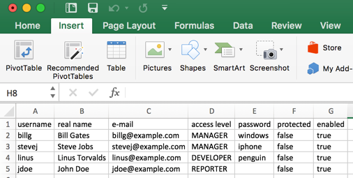
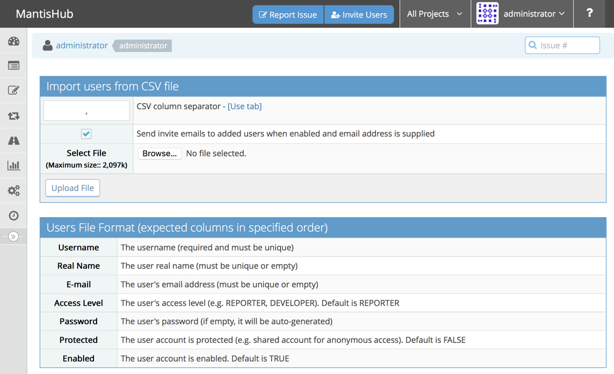
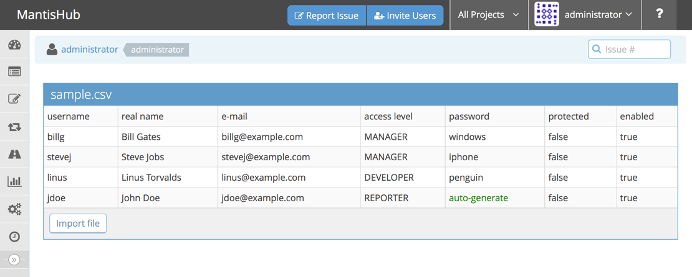
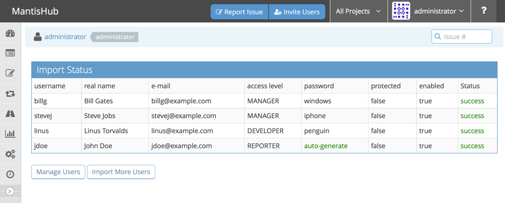

# Import Users from CSV

A plugin that enables administrators to import a list of users into Mantis.

Compatibility

- This plugin is compatible with [MantisBT Modern UI v1.3](https://github.com/mantishub/mantisbt).

# Installation Instructions

- Download or clone the repository and place it under the MantisBT plugins folder.
- Go to Manage - Manage Plugins and install the plugin.
- Go to Manage - Import Users

## Sample CSV File

## Import Form

## Preview Page

## Results Page

