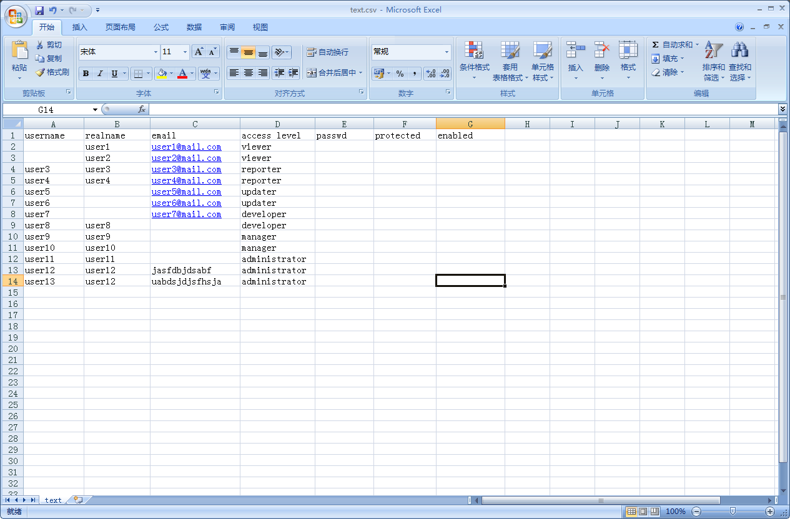
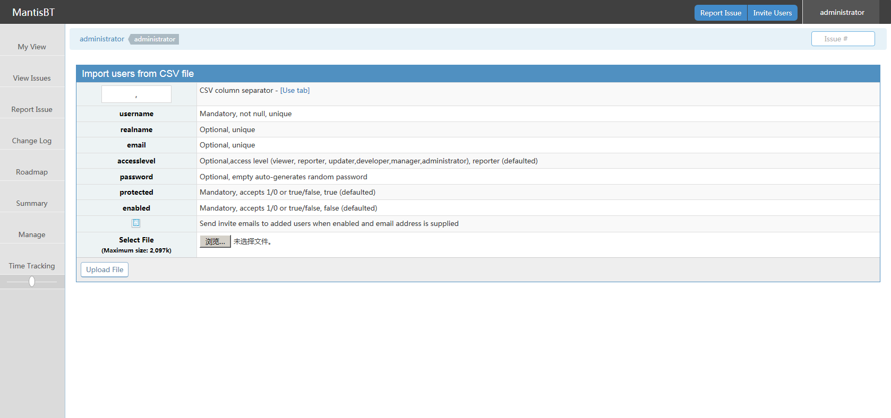
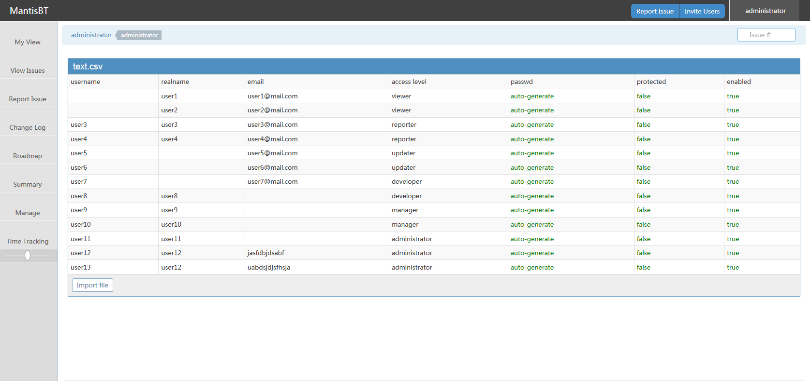
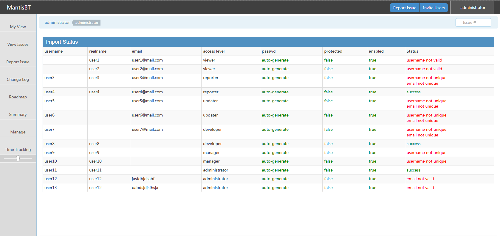

# Import Users from CSV

A plugin that enables administrators to import a list of users into Mantis.

Compatibility

- This plugin is compatible with MntisBT Modern UI v1.3.
- See [https://github.com/mantishub/mantisbt](https://github.com/mantishub/mantisbt).

# Installation Instructions

- Download or clone the repository and place it under the MantisBT plugins folder.
- Go to Manage - Manage Plugins and install the plugin.
- Go to Manage - Import Users

# Few hints about usability

- Set send/not send the invite email by check/uncheck the invite email option in the init page.

## Csv file demo

## Preview page

## Sample page

## Import status page

>>>>>>> 73d28d0... Plugin for import users via csv
